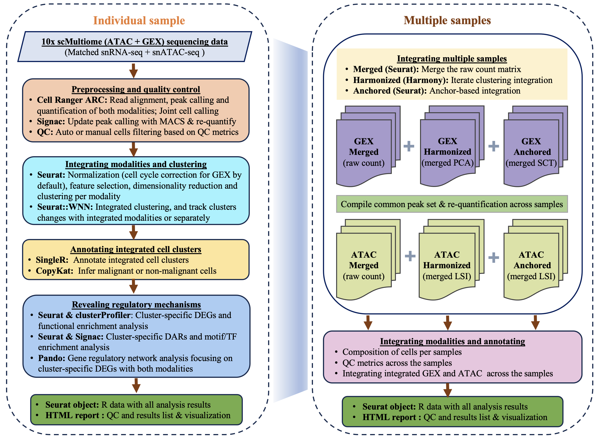

# iSHARC: <ins>I</ins>ntegrating <ins>s</ins>cMultiome data for <ins>h</ins>eterogeneity <ins>a</ins>nd <ins>r</ins>egulatory analysis in <ins>c</ins>ancer (v1.0.0_beta)


## Introduction
This pipeline is designed for automated end-to-end quality control (QC) and analysis of 10x Genomics scMultiome data. It has been developed by [Yong Zeng](mailto:yzeng@uhnresearch.ca), building upon some prior efforts from Mathieu Lupien Lab and feedbacks from scMultiome Working Group at Princess Margaret Cancer Centre.


### Features
- **Portability**: The pipeline was developed with [Snakemake](https://snakemake.readthedocs.io/en/stable/index.html), which will automatically deploy the execution environments. It can also be performed across different cluster engines (e.g. SLURM) or stand-alone machines.
- **Flexibility**: The pipeline can be applied to individual samples, as well as to integrate multiple samples from various conditions.

### Citation
Work-in-progress

### How it works
This schematic diagram shows you how pipeline will be working:



## Installation
1) Make sure that you have a Conda-based Python3 distribution(e.g.,the [Miniconda](https://docs.conda.io/en/latest/miniconda.html)). The Miniconda3-py38_23.3.1-0-Linux-x86_64.sh for Linux is preferred to avoid potential conflicts. The installation of [Mamba](https://github.com/mamba-org/mamba) is also recommended:

	```bash
	$ conda install -n base -c conda-forge mamba
	```

2) Git clone this pipeline.
	```bash
	$ cd
	$ git clone https://github.com/yzeng-lol/iSHARC
	```

3) Install pipeline\'s core environment
	```bash
	$ cd iSHARC
	$ conda activate base
	$ mamba env create --file conda_env.yaml
	```

4) Test run
	> **IMPORTANT**: ONLY EXTRA ENVIRONMENTS WILL BE INSTALLED, MAKE SURE YOU STILL HAVE INTERNET ACCESS.

	```bash
	$ conda activate iSHARC
	$ snakemake --snakefile ./workflow/Snakefile \
	            --configfile ./test/config_template.yaml \
		    --conda-prefix ${CONDA_PREFIX}_extra_env \
	            --use-conda --conda-create-envs-only -c 1 -p
	```
5) The [cellranger_arc](https://support.10xgenomics.com/single-cell-multiome-atac-gex/software/pipelines/latest/what-is-cell-ranger-arc), [MACS2](https://github.com/macs3-project/MACS/wiki/Install-macs2) and corresponding genome reference, such as [GRCh38](https://cf.10xgenomics.com/supp/cell-arc/refdata-cellranger-arc-GRCh38-2020-A-2.0.0.tar.gz), must be installed and downloaded prior to a full run. You will need to specify their PATHS in the config.yaml file.  

6) Run on HPCs
	You can also submit this pipeline to clusters with the template ./workflow/sbatch_Snakefile_template.sh. This template is for SLURM, however, it could be modified to different resource management systems. More details about cluster configuration can be found at [here](https://snakemake.readthedocs.io/en/stable/executing/cluster.html).

	```bash
	## Test run by SLURM submission, need to modify the PATHs accord your own real dataset
	$ sbatch ./workflow/sbatch_Snakefile_template.sh
	```
