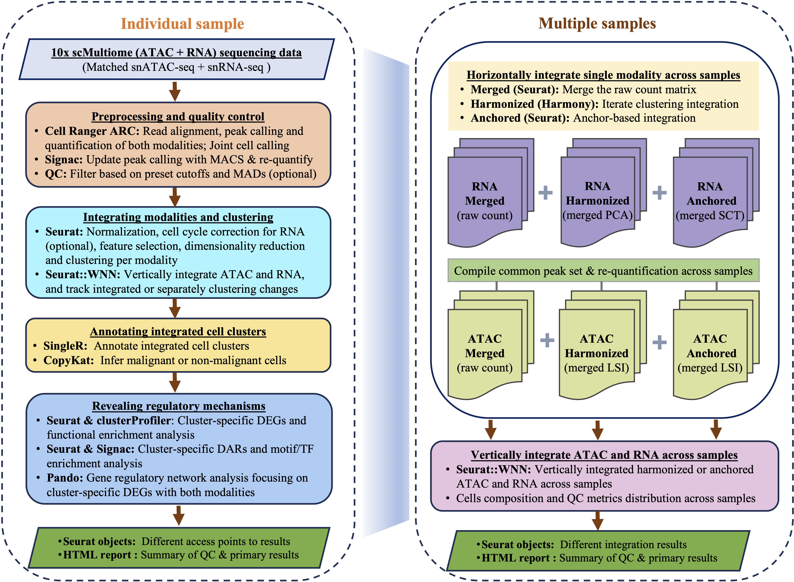

# iSHARC: <ins>I</ins>ntegrating <ins>s</ins>cMultiome data for <ins>h</ins>eterogeneity <ins>a</ins>nd <ins>r</ins>egulatory analysis in <ins>c</ins>ancer (v1.0.0_beta)


## Introduction
This pipeline is designed for automated, end-to-end quality control (QC) and analysis of 10x Genomics scMultiome data (paired snRNA-seq and snATAC-seq data). It was developed by [Yong Zeng](mailto:yzeng@uhn.ca), building on prior contributions from the Mathieu Lupien Lab and incorporating feedback from the scMultiome Working Group at the Princess Margaret Cancer Centre.


### Features
- **Portability**: The pipeline was developed using [Snakemake](https://snakemake.readthedocs.io/en/stable/index.html), which will automatically deploy the execution environments. It supports execution across various cluster engines (e.g., SLURM) or on standalone machines.
- **Flexibility**: The pipeline is versatile, enabling analysis of individual samples as well as the integration of multiple samples from different conditions.


### Citation
Work-in-progress


### How it works
This schematic diagram shows you how pipeline will be working:



## Installation
1) Ensure you have a Conda-based Python3 distribution installed (e.g.,the [Miniconda](https://docs.conda.io/en/latest/miniconda.html)). If your Conda version is earlier than v23.10.0, it is recommended to install [Mamba](https://github.com/mamba-org/mamba) for improved performance and reliability

	```bash
	$ conda install -n base -c conda-forge mamba
	```

2) Git clone this pipeline.
	```bash
	$ cd
	$ git clone https://github.com/yzeng-lol/iSHARC
	```

3) Install pipeline\'s core environment
	```bash
	$ cd iSHARC
	$ conda activate base
	$ mamba env create --file conda_env.yaml
	```

4) Install pipeline\'s additional environment
	> **IMPORTANT**: ONLY EXTRA ENVIRONMENTS WILL BE INSTALLED, MAKE SURE YOU STILL HAVE INTERNET ACCESS.

	```bash
	$ conda activate iSHARC
	$ snakemake --snakefile ./workflow/Snakefile \
	            --configfile ./test/config_template.yaml \
		    --conda-prefix ${CONDA_PREFIX}_extra_env \
	            --use-conda --conda-create-envs-only -c 1 -p
	```

	> **IMPORTANT**: The required version of the Matrix package conflicts with TFBSTools, leading to the error: "object 'R_sparse_marginsum' not found". To resolve this issue for now:

	Step 1. Activate the extra environment you installed earlier.
	```bash
	$ extra_env_path=${CONDA_PREFIX}_extra_env
	$ conda deactivate                        
	$ conda activate  ${extra_env_path}/*_   env with hashed name
	$ R   
	```

	Step 2. Force a reinstallation of TFBSTools from the source in R.
	```r
	> if (!require("BiocManager", quietly = TRUE)) install.packages("BiocManager")
  > BiocManager::install("TFBSTools", type = "source", force = TRUE)
	``` 

5) Test run

	To perform a test run using the demo datasets, refer to the configuration and sample information templates and introductions provided within the [test](./test/) folder.


6) Run on HPCs

	You can also submit this pipeline to clusters with the [template](./workflow/sbatch_Snakefile_template.sh). While this template is configured for SLURM, it can be adapted for other resource management systems. For More details about cluster configuration, refer to the [Snakemake documentation](https://snakemake.readthedocs.io/en/stable/executing/cluster.html).

	```bash
	## Test run by SLURM submission, need to modify the PATHs accord your own real dataset
	$ sbatch ./workflow/sbatch_Snakefile_template.sh
	```


## Trouble Shooting
For troubleshooting issues related to pipeline installation and execution, please refer to [this document](./assets/Trouble_Shooting.md). This document will be continuously updated to address errors reported by users.
